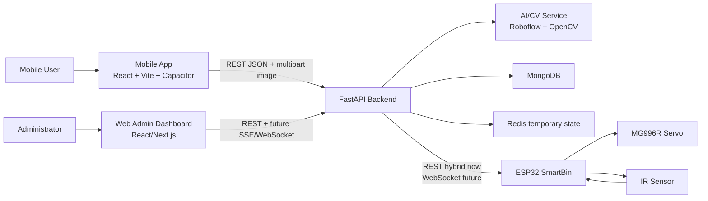

# Architecture Notes

EcoDrop follows the Deliverable 3 service-oriented architecture:

Important decisions:

- The backend is the source of truth for points and transaction status.
- Mobile and web should never compute final reward state independently.
- AI/CV can be mocked during integration, but response shape must stay stable.
- ESP32 communication starts as REST + polling for demo robustness, with a future WebSocket path allowed by the contract.
